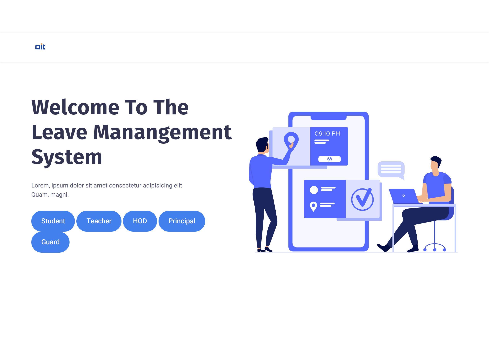
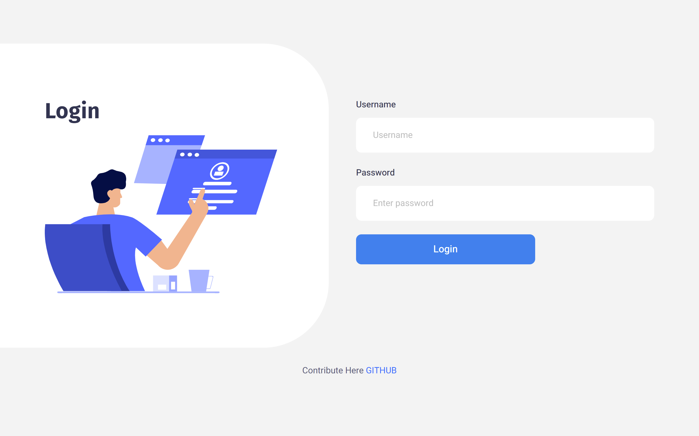
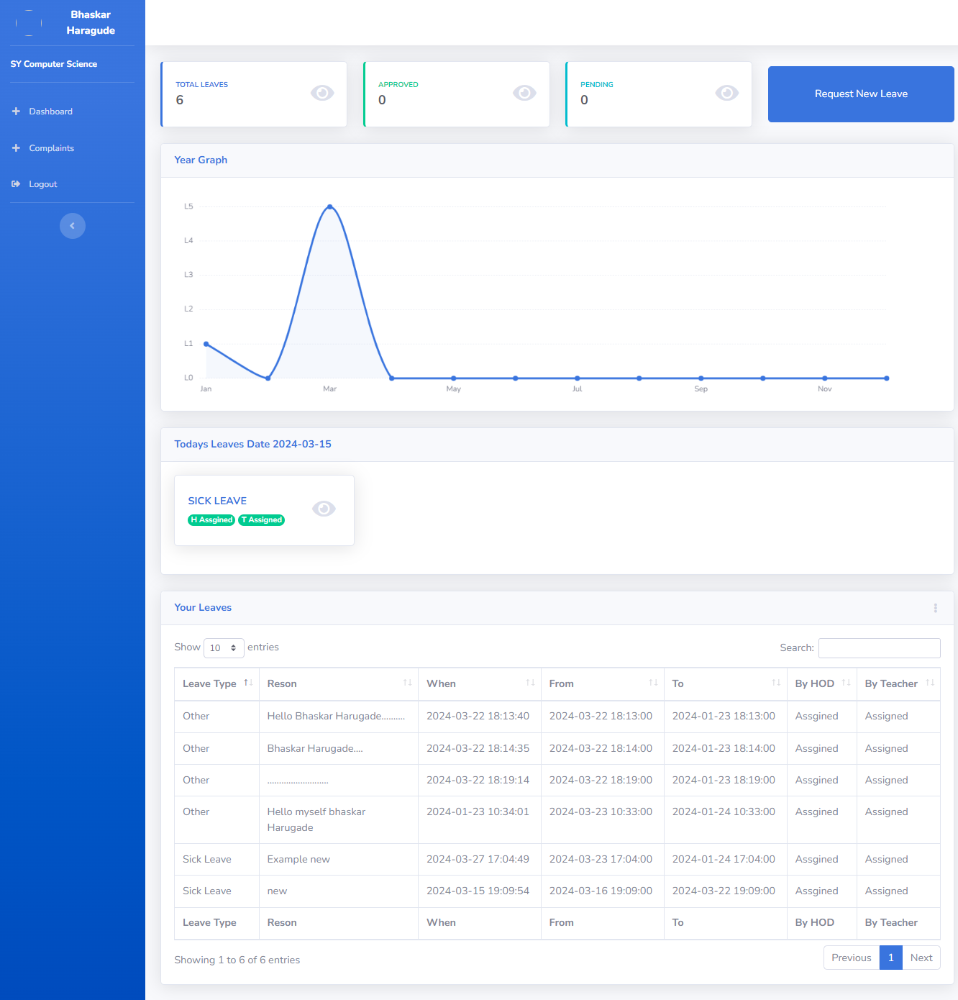
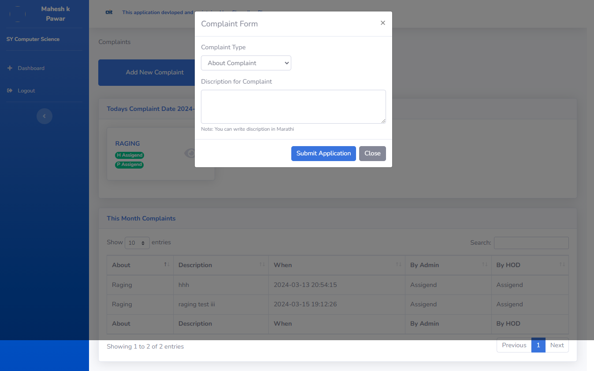
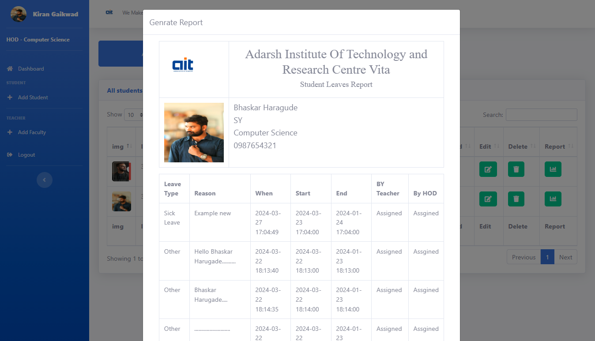
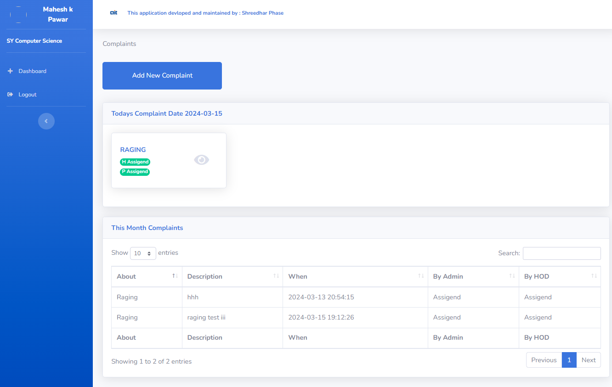

# University Student Leave Management System

Welcome to the University Student Leave Management System! This system is designed to streamline the leave management process for both students within the university. It also includes features such as SMS alerts and a complaint system for efficient communication between students and teachers.

## Features

### 1. Leave Management
   - **Student Leave Request:** Students can submit leave requests through the system.
   - **Leave Approval:** Teachers can view and approve/reject leave requests submitted by students.
   - **Leave History:** Students can view their leave history, including approved and pending leave requests.
   - **Calendar View:** Both students and teachers can view leave requests in a calendar format for better visualization.

### 2. SMS Alerts
   - **Leave Status Updates:** Student Parents receive SMS alerts notifying them of the status of their leave requests (approved/rejected).
   - **Reminders:** Reminders for upcoming leaves are sent to both students and teachers.
   - **Report Genration**

### 3. Complaint System
   - **Student Complaints:** Students can submit complaints regarding various issues through the system.
   - **Report Genration**
   - **Teacher Response:** Teachers can view and respond to student complaints, providing necessary assistance or resolutions.
   - **Track Complaint Status:** Students can track the status of their complaints, whether they are pending, resolved, or in progress.

## Roles and Responsibilities

### Students:
- Submit leave requests.
- View leave history.
- Submit complaints.

### Teachers:
- Approve/reject student leave requests.

### HODs (Heads of Departments):
- Approve/reject student leave requests.
- View student and teacher complaints and provide necessary assistance.

### Principal:
- View student leave requests.
- View student and teacher complaints and provide necessary assistance.

### Guards:
- Manage leave requests submitted by guards.
- Review and update leave request statuses.

## Technologies Used

- **Frontend:** HTML, CSS, Bootstrap
- **Backend:** PHP
- **Database:** MySQL
- **SMS Service:** Twilio API
- **Authentication:** JWT (JSON Web Tokens)

## Screenshots

Below are screenshots of key sections of the system:

1. **Home Page:**

   1.

2. **Login Page:**

   

3. **Home Page:**

   

4. **Leave Request Form:**

   

5. **Leave History:**

   

6. **Complaint Submission Page:**

   

## Installation

1. Clone this repository to your local machine.
2. Import the database schema provided in `database.sql`.
3. Configure database connection settings in `config.php`.
5. Run the application on a PHP server.

## Contributors

- Ranjit Patil (@ranjit485)
- Bhaskar Harugade (@bhaskar3512)
